# AVR-IBus<br>`DIY Modul for BMW Cars with I-/K-Bus`
## Kickstart Description
In case of using the Raspberry in the car, there was a topic about the powersuply and long bootup time.
Inspired by other Interfaces like pibus, Intravee, eLight, modLight i decided to develop a specific shield.
After some time and some requestes the standalone modul was born.

## Modes
- **AVR Mode** 
	- Raspberry Shield or standalone modul with GUI for OEM System
	- Using OSMC or LibreElec with the Addon [IBusCommunicator](https://www.bmwraspcontrol.de/board/showthread.php?tid=295) for Kodi
- **IBus Interface Mode** 
	- you can use this DIY Modul as usual USB IBus-Interface also (e.g. for Android Radio Headunits)
	- upload the other Firmware to get it working
	- because my project is one of the pioneers for [I-BUS App](www.ibus-app.de) to develop their own next IBus Modul
	- hope i will get more Support for the functionality with the App

## Features
- CD-Changer Emulation
- Welcome Message on E39 IKE High
- Welcome/Leaving Light depended by Brightness
- Lightsequenzes for: *
	- Welcome
	- Leaving
	- Follow Home
	- Flash2Pass
- Mirror Folding
	- unfold/fold for Welcome/Leaving
	- fold Mirrors by Ingintion Position Off * 
	- unfold Mirrors by Ingintion Position On * 
	- unfold Mirrors by double press Open on Remote * 
	- fold Mirrors by double press Close on Remote * 
	- fold Mirrors by hold Close on Remote * 
	- unfold/fold by Key insert or remove of Ignition Lock * 
	- unfold Mirrors by Door opening * 
- Flash to Pass
- One Touch direction signal
- Fog Corner Lights for E39
- Day Running Light
- Aux-Heating control by Remote Key
- Brake Force Display (Coding of IKE requiered) * 
- Convertible Roof Control for E46 by Remote Key
- Auto-Relock for Central Lock after Unlock and no door was opened
- Auto-Zoom for Navigation Map by Speed
- PDC Display at E39 IKE High * 
- OBC-Value Display at E39 IKE High [Coolanttemp, Speed, Oiltemp or Voltage] (**under construction**)
- RearCam power control and enable Video input at TV-Modul
- Configuration Options:
	- Menu for Bordscreen
	- Menu for MID (**under construction**) * 
	- Serial-Protocol [(see Describtion below)](https://github.com/harryberlin/AVR-IBus.public#serial-communiton-portsettings)
- Cross platform Configuraton Tool (Windows, Linux, Mac)

*only V2

## Versions
- [x] V1 RaspPi - Shield for Raspberry Pi
  <br>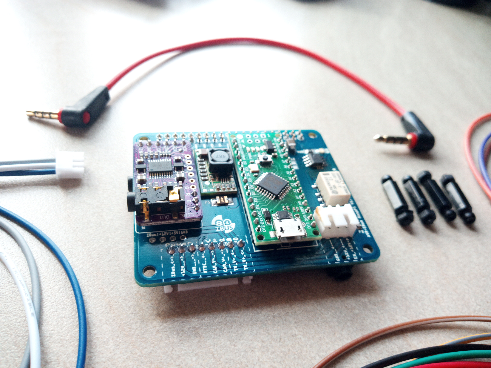 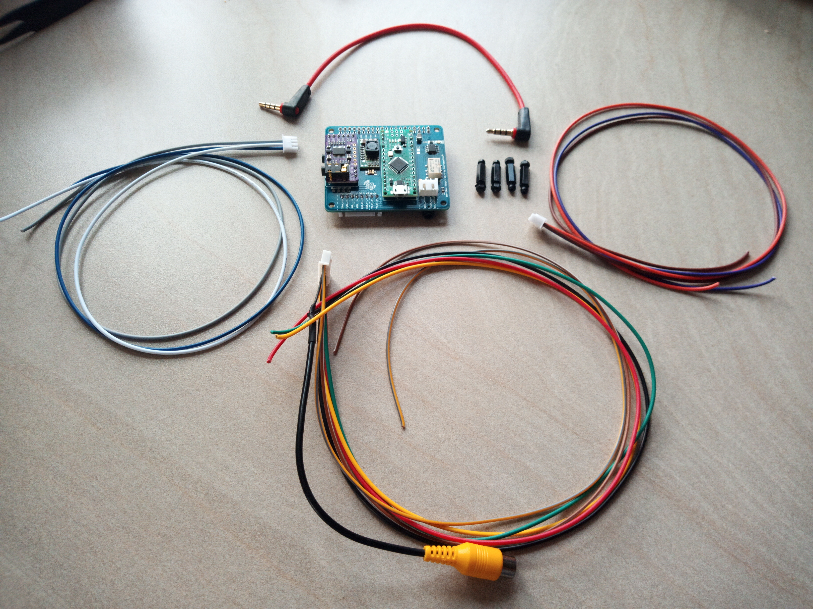<br>
- [x] V2 RaspPi - Shield for Raspberry Pi
  <br>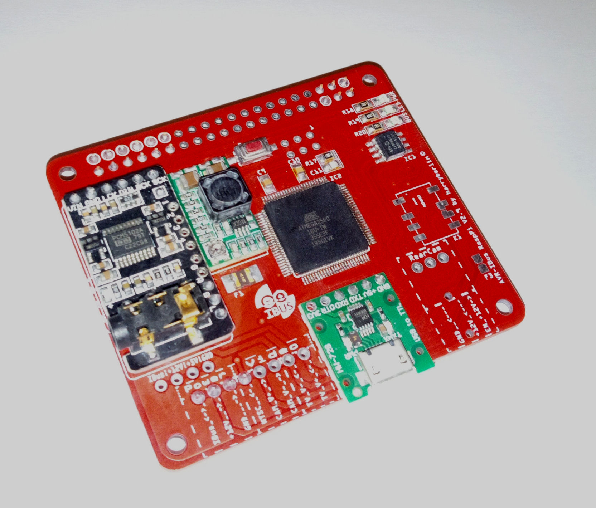 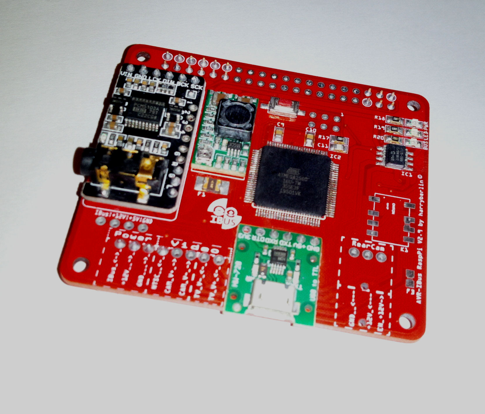<br>
- [x] V2 Basic - Standalone Modul
  <br>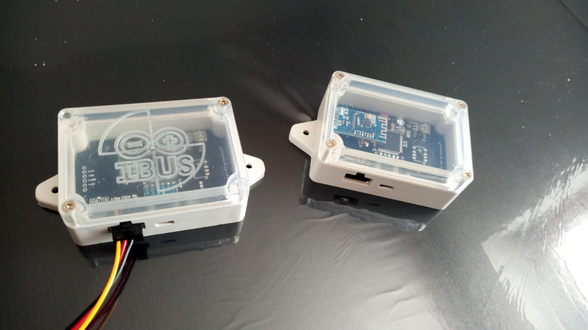 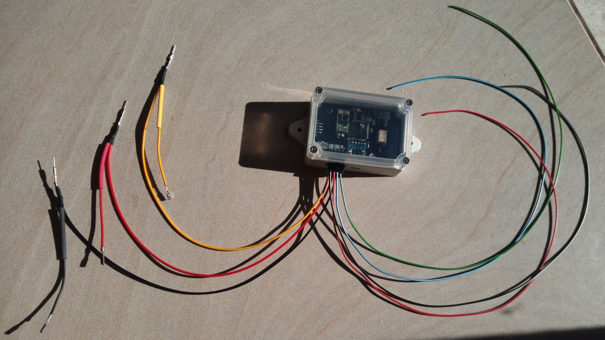<br>

## Next Steps / ToDo
- Extension for Bluetooth A2DP Audio Streaming (only for Basic)
- finish Android App for Configuration
- Request RLS for Welcome/Leaving
- may modify RCam-Control for other Solutions (e.g. Coolant Thermostat)
- Feature Requests:
	- Move down Mirror for Parking
	- Features like LinBusBox/IBusBox


## Simple Basic Schematics
- V1.x
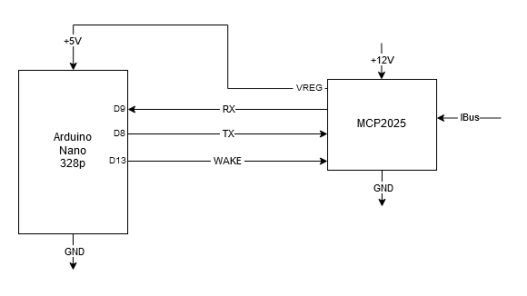<br>
- V2.x
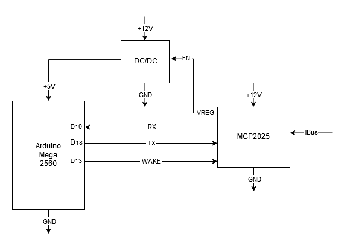


## Userinterface in the Car
For opening GUI of OEM BMW Infotaimentsystem:
- do Double press MENU-Key of Bordscreen<br>
  <br>
- do Double press BC-Key of MID<br>
  [](https://www.youtube.com/watch?v=R0ln4EWvLRM "AVR-IBus Settings Menu on E39 MID")  
  (check the video)

## Serial Communication 
### Port-Settings
<details>
	<summary>show</summary>
	
|            |     AVR Mode     |     IBus Mode     |
| ---------- | ---------------- | ----------------- |
|Baud:       | `38400`          | `9600`            |
|DataBits:   | `8`              | `8`               |
|Parity:     | `None`           | `Even`            |
|StopBits:   | `1`              | `1`               |
|Handshaking:| `None`           | `None`            |
</details>

### Settings / Serial-Protocol-Commands
<details>
	<summary>show</summary>
	
<br>Terminate the Commands with **CR (Carrige Return).**<br>
	
| No | Setting / Command (Default) |    Value A   |    Value B   | Description |
| -- | --------------------------- | ------------ | ------------ | ---------------------------------- |
|    | `TX:IBUSMESSAGE` |||Send IBus Message to the Car. Length and/or Checksum are not requiered (example: TX:68LL18380000CK CD StateRequest)|
|    | `PING` ||| Alive request. The Modul replies PONG|
|    | `DIAG` ||| Request for DIAG Mode. The Modul replies DIAG Mode Level|
|    | `DIAG:0`| 1=(partly<br>20full | |Diag Mode for use with Diagsoftware like Inpa, to don't get a collision with diagnostic commands.|
|    | `AV` ||| Request for AV PIN State. The Modul replies AV NTSC PIN state|
|    | `AV:0` |1=enable<br>0=disable|| Sets NTSC Line for PIN 5 of Videomodul. If enabeled, you have to ping (every 10s reach out), otherwise the Modul disables the signal after 30sec timeout.|
|    | `LIGHT` ||| Starts/Stops Welcome Light|
|    | `CVM:OPEN` ||| Starts 30sec process for opening E46 convertible|
|    | `CVM:CLOSE` ||| Starts 30sec process for closing E46 convertible|
|    | `CVM:STOP` ||| Stops the opening or closing process for E46 convertible|
|    | `SHUTDOWN` ||| Initiates Shutdown Process. Shuts down the Rasp/Powersuply (takes 60s for power down) the modul sends every second "SHUTDOWN" so the serial reader should shutdown itself.|
|    | `GET:STS` ||| Request for all Setting Values|
|    | `SET:RST` ||| Resets to Default Settings|
|    |             |               | |                                             |
| 01 | `SET:CDC_EMU:1`| 0=OFF<br>1=ON | | Enable/Disable CD Changer Emulation<br>to get Radio Mode CD-Changer<br>as Input Source |
| 16 | `SET:WEL:MSG:0`| 0=OFF<br>1=ON | | Enable/Disable Welcome Message at IKE<br>Display after unlocking<br>the Car |
| 40-59 | `SET:WEL:MSG_T:AVR~IBus`| | | Set Text for Welcome Message. 20 chars |
| 02<br>03 | `SET:WEL:LIGHT:45:0`| 0=OFF<br>1-255 Seconds | Bits:<br>0=Start Engine<br>1=Insert Key<br>2=Open Door<br>4=Ignition Acc (Pos 1) | **A** Welcome Light Duration in Seconds<br>**B** Event to Cancel the Welcome Light. Bitmask (76543210) to Integer. |
| 04 | `SET:LEV:LIGHT:15`| 0=OFF<br>1-255 Seconds | | Leaving Light Duration in Seconds |
| 05<br>09 | `SET:MIR_FOLD:0`| Bits for Folding & Event:<br>0=In Leaving<br>1=Out Welcome<br>2=In Ign Off *<br>3=Out IgnOn *<br>4=In FFB Double *<br>5=Out FFB Double *<br>6=In FFB Hold *<br>7=Out Open Door * | Bits for Folding & Event:<br>8=Key remove *<br>9=Key insert *<br>10=Engine Start * | Enable/Disable MirrorFolding for Events. Bitmask (109876543210) to Integer. |
| 06 | `SET:LIGHT:SEN_VAL:40`| 0-254=Value<br>255=OFF | | Enable/Disable Brightness Sensor for Welcome/Leaving Light.<br>Value for Comparing the Sensor. Lower Value needs<br>more darkness to turn on the Lights. Good Value range is 30 - 40. |
| 07 | `SET:F2P:0`| 0=OFF<br>1=Low Beam<br>2=Fog Front<br>3=Both<br>4=Sequenz * | | Enable/Disable Flash to Pass. Enabled Lights will turn on the by High Beam |
| 08 | `SET:LIGHT:PARK:3`| Bits:<br>0=Front<br>1=Back<br>2=Back (Inside) | | Enable/Disable Park Lights for Welcome/Leaving Light.<br>Bitmask (76543210) to Integer |
| 10 | `SET:LIGHT:BEAM:0`| Bits:<br>0=Low<br>1=High | | Enable/Disable Beam Lights for Welcome/Leaving Light.<br>Bitmask (76543210) to Integer |
| 13 | `SET:LIGHT:TURN:0`| Bits:<br>0=Front<br>1=Back<br>2=Side | | Enable/Disable Direction Lights for Welcome/Leaving Light.<br>Some old build year can't use "Side" alone<br>Bitmask (76543210) to Integer |
| 11 | `SET:LIGHT:OTHER:0`| Bits:<br>0=Fog Front<br>1=Licence<br>2=Reverse<br>3=Brake<br>4=Ambient<br>5=Fog Back | | Enable/Disable further Lights for Welcome/Leaving Light.<br>Bitmask (76543210) to Integer |
| 17 | `SET:BLINK:3`| 0=OFF<br>2-10=Repeat | | Enable/Disable one touch Direction Signal (Comfortblink).<br>Set repeat interval. |
| 18 | `SET:LOCK_SPD:0`| 0=OFF<br>1-255km/h | | Enable/Disable auto lock car by speed. |
| 31 | `SET:UNLOCK:1`| Bits:<br>0=Door<br>1=Handbrake<br>2=Gear Position P<br>3=Ignition Engine off | | If Setting auto lock is enabled, do auto unlock the car by events.<br>Bitmask (76543210) to Integer |
| 35 | `SET:RELOCK:0`| 0=OFF<br>1-255min | | Enable/Disable auto relock the car after unlocking and no door was opened.<br>Minutes for auto relock (open Trunk restarts the Countdown)<br>(!! BE CAREFUL IF YOU PLACE YOUR KEY INSIDE THE CAR !!)|
| 20 | `SET:RXTX:0`| 0=RX<br>1=TX | | Enable/Disable received and transmitted IBus Messages.<br>Bitmask (76543210) to Integer |
| 19<br>21 | `SET:FOG_TURN:60:3`| 0-255km/h | 0=OFF<br>1-255s | **A** Speed Range to trigger the Event.<br>**B** Enable/Disable Fog Corner Lights for E39.<br>Seconds Delaytime for Fog Turn Light.Event is triggerd by Direction signal and park lights must be on.<br>If you reach the Speed or time is over, corner light will turn off. |
| 22 | `SET:DRL:0`| Bits:<br>0=Parklight<br>1=Fog Front<br>2=Taillight | | Enable/Disable Day Running Light at Ignition Pos 2 and Lights Off.<br>Bitmask (76543210) to Integer |
| 23 | `SET:NTWC:0`| 0=E39<br>1=E52<br>2=E46<br>3=R40<br>4=RR01<br>5=E83<br>6=R50<br>7=R55<br>8=E65 | | Define Network Vehicle Type.<br>Will be set automaticly. |
| 24 | `SET:NTWM:0`| 0=ZKE<br>1=GM/0<br>2=GM/1 | | Define Network Mode.<br>For different Functions of production year. |
| 25 | `SET:TIME_OFF:3`| 1-255min | | Timeout for Shutdown minutes on IBus idle. |
| 26 | `SET:OBC_DISP:0`| 0=OFF<br>1=Coolanttemp.<br>2=Driving<br>Speed<br>3=Oiltemp. | | Shows OBC Values on IKE High Display or E46 Radiodisplay in CD Mode. |
| 27 | `SET:HEAT_FFB:0`| 0=OFF<br>1=ON | | Enable/Disable Function Aux-Heat Activation by holding Remote Key Lock. |
| 28 | `SET:CVM_FOLD:0`| 0=OFF<br>1=ON | | Enable/Disable Function Convertible Roof Open/Close by holding Remote Key Unlock/Lock. |
| 30 | `SET:BFD:0`| 0=OFF<br>1-7=Seconds | | Enable Flashing Rear Turnlights for Emergency Brake.<br>Delaytime for flashing after BFD turned off in Seconds. (IKE Coding requiered)<br>// IKE & KOM (beginning Manufäcturing Year 2001, better 09/2001) //<br>BRAKE_FORCE<br>    aktiv<br>BRAKE_FORCE_2<br>    aktiv<br>ASC3_AUSWERTUNG<br>    aktiv<br>BFD_AX_REF_SCHWELLE<br>    wert_01<br>BFD_AX_REF_SCHWELLE_2<br>    wert_01 |
| 32<br>33 | `SET:RCAM:0:15`| 0=OFF<br>1-255km/h | 15s | **A**  Enable/Disable RCam Switch. Speedlimit for turning off RCam.<br>**B** Timeout for turning off RCam in Seconds. |
| 36 | `SET:NAVZ:0`| 0=OFF<br>1=ON | | Enable/Disable AutoZoom for Navigation Map. |
| 37 | `SET:PDCSCR:0`| 0=OFF<br>1=Front+Back<br>2=Back | | Enable/Disable PDC Values to IKE High Display and PDC Type. |
| 38 | `SET:REQS:255`| Bits:<br>0=GM State<br>1=LCM Dim | | Enable (Bit to 1)/Disable (Bit to 0) Request Messages. In some Cases the IKE will stop showing Indicator LEDs.<br>Bitmask (76543210) to Integer |


| Setting / Command |    Value A   |    Value B   |    Value C   |    Value D   | Description |
| ----------------- | ------------ | ------------ | ------------ | ------------ | ----------- |
|SET:A:SEQ:B:C:D|WEL=Welcome<br>LEV=Leaving<br>FOL=Follow Home<br>F2P=Flash to pass||||Set Light Sequenzes (use Excel Tool to generate the command)<br>It's not possible to set Light Sequenzes in OEM Gui, only enabling or disabling. For Creating, uploading and simulating of Sequenzes use the Excel Macro helper tool.<br>**A** Event<br>**B** Sequenz Number<br>**C** Lights as Integer<br>**D** Duration Time (1 = 0,1s)|
</details>	    

### IBus MSGs for IBus Interface Mode
<details>
	<summary>show</summary>

SRC or Dst
FB is config device
FA is AVR IBUS device

**CMD**<br>
08 read setting<br>
09 write setting<br>
0C control (00 reset Settings, 01 set ntsc high or low)<br>
**Example:**<br>
`FB LL FA 08 01 CK` - read setting CDC_EMU<br>
`FB LL FA 09 01 00 CK` - write setting CDC_EMU = off<br>

`FB 05 FA 09 05 03 0B` Mirror Fold IN+OUT<br>
`FB 05 FA 09 05 00 08` Mirror Fold OFF<br>
</details>

## Setup for Raspberry
<details>
	<summary>show</summary>    

- add to config.txt
  - ```dtoverlay=pi3-miniuart-bt``` to get GPIO Serialport working
  - ```dtoverlay=hifiberry-dac``` to enable I2S for Hifi DAC
- in some cases you have to set volume to 80%
- in Raspbian use Serial Device: ```/dev/ttyAMA0```
- for [IBusCommunicator](https://github.com/harryberlin/repository.harryberlin/tree/master/plugin.script.ibuscommunicator) Kodi Addon:
  - in Topic Main set Serial Device to CUSTOM and define custom device for /dev/ttyAMA0<br>
    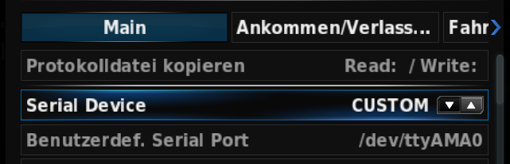<p>
  - in Topic I/O-Boards: Enable Arduino<br>
    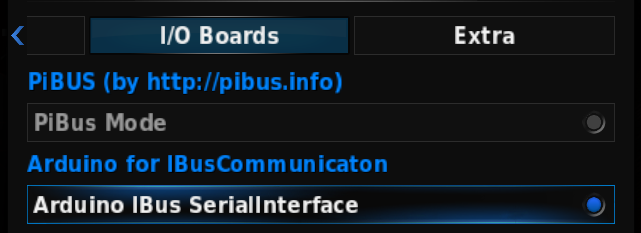<p>
</details>	    

## Development Steps for RaspPi Shield
<details>
	<summary>show</summary>

- Breadboard<br>
  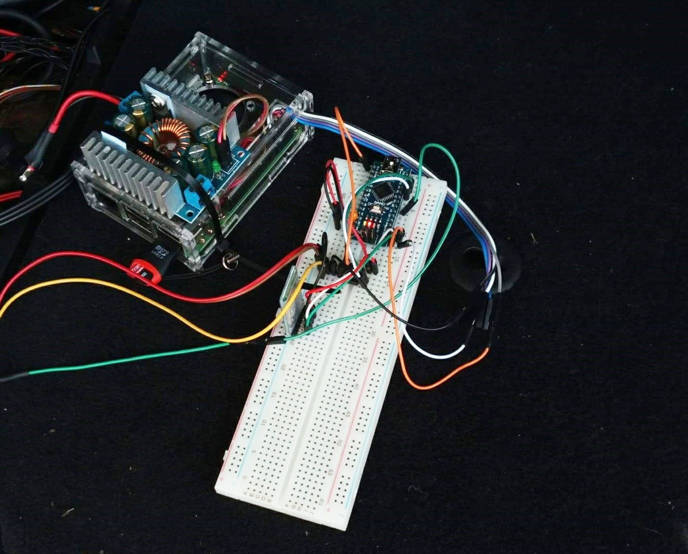<p>

- Prototyp<br>
  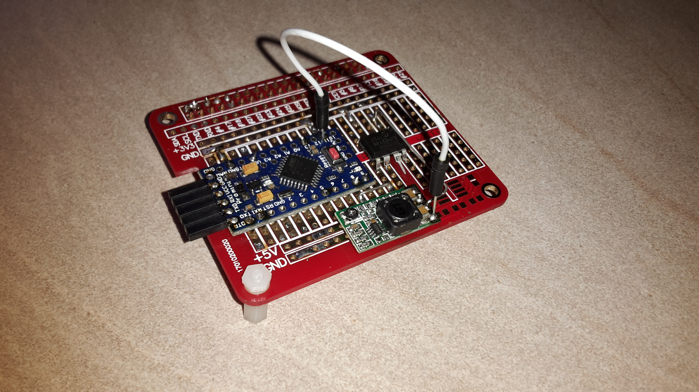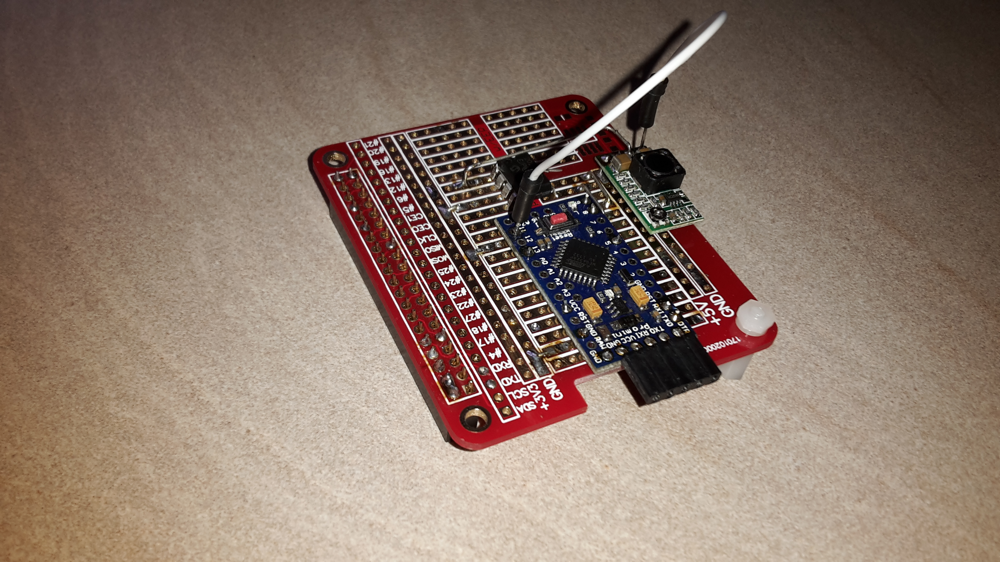<br>
  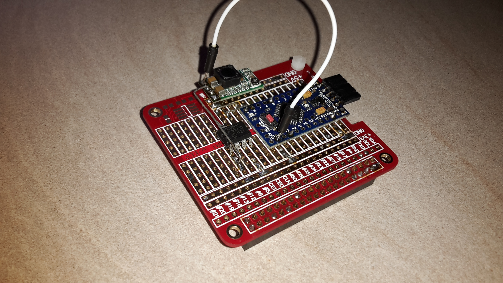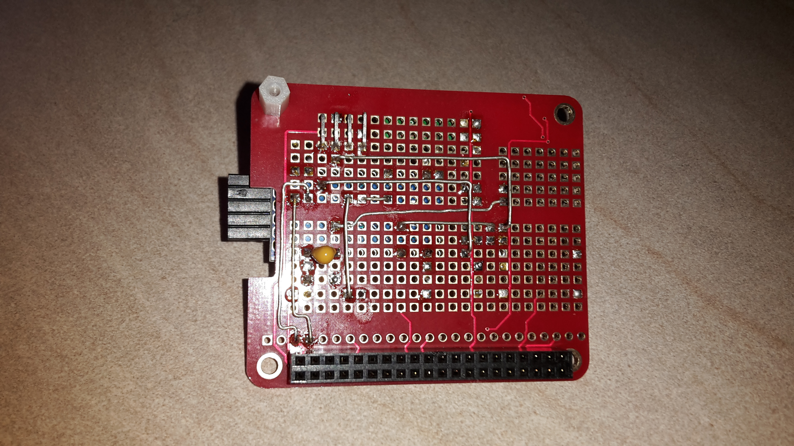<p>
- PCB V1.0<br>
  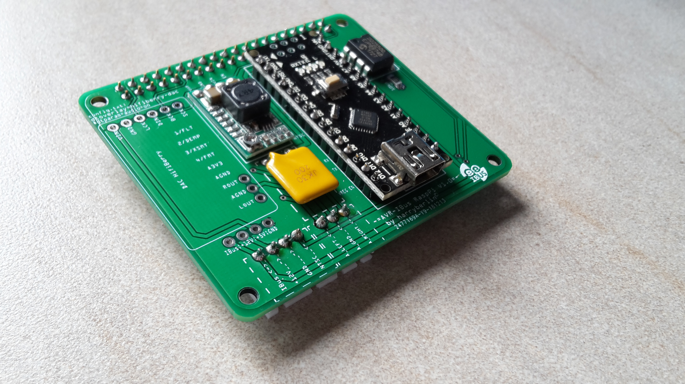<br>
  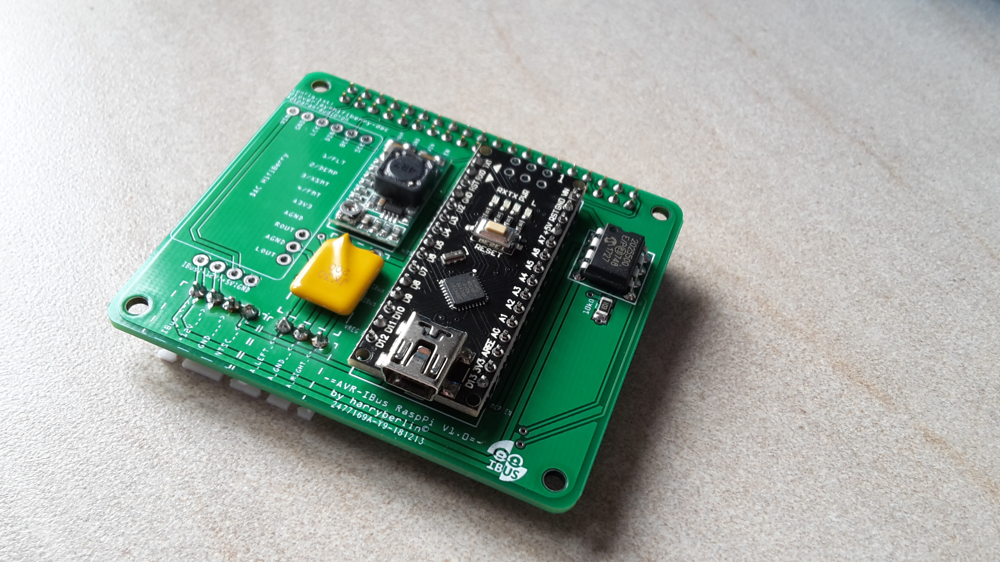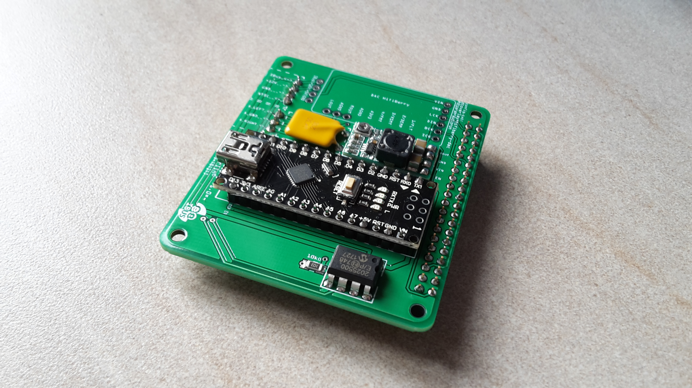<br>
  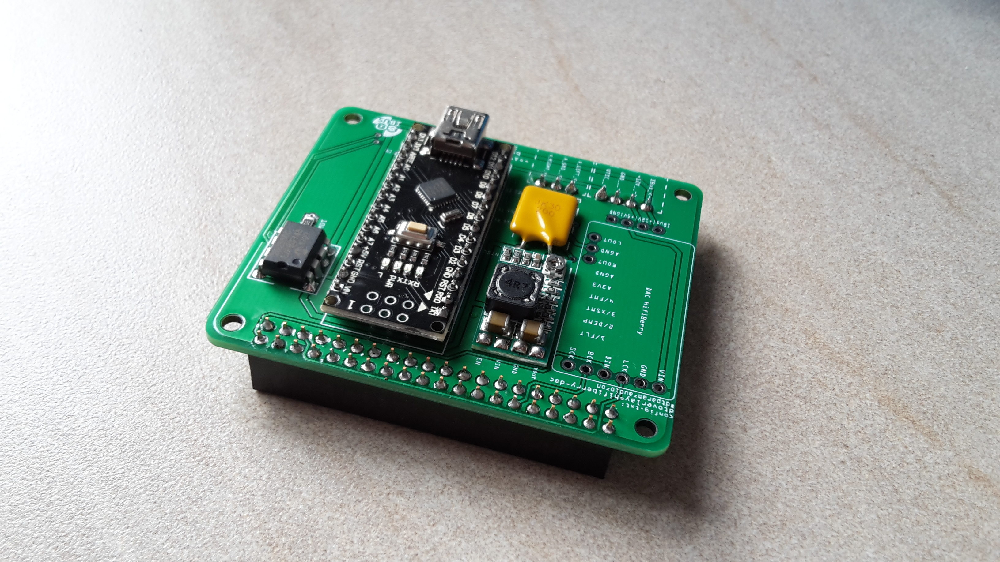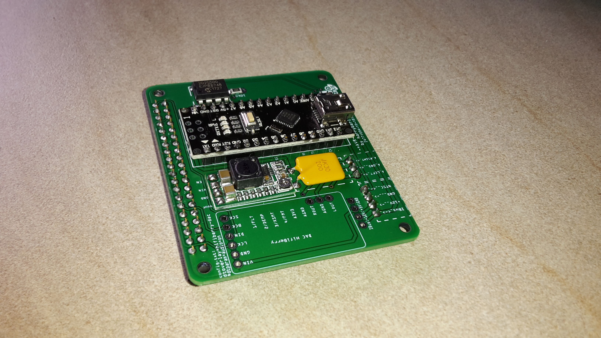<p>
- PCB V1.0 with HifiDAC<br>
  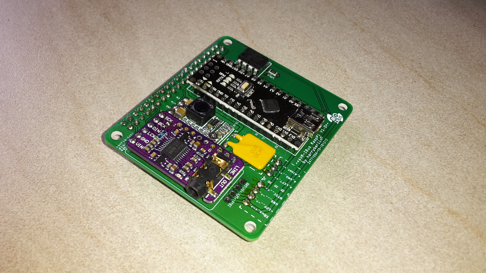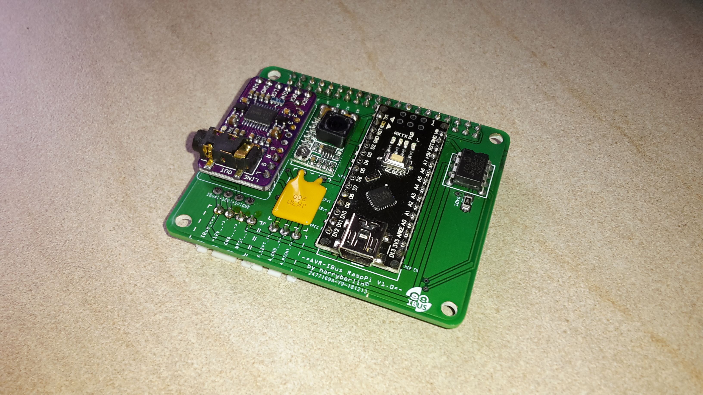<br>
  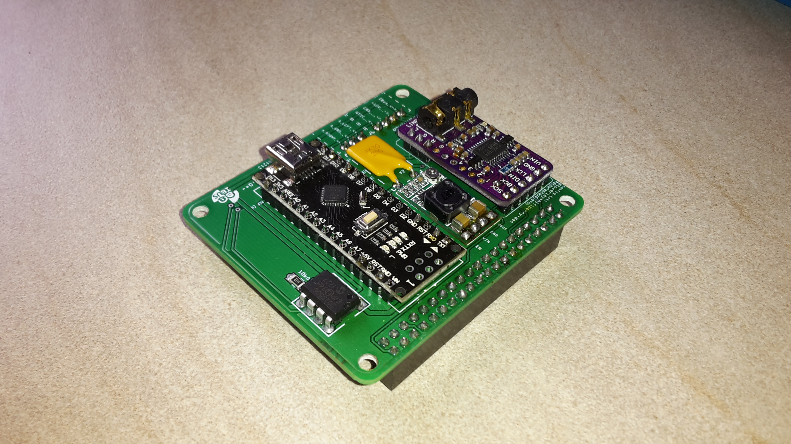
</details>

## 3rd Party
used Librarys:
- Arduino
- AltSoftSerial
- SimpleTimer
- EEPROM

All mentioned brands and trademarks (e.g. product and company names) belong to their respective owners.

## Disclaimer
Use of the hardware / software is at your own risk.  In the unlikely event that it comes to malfunction, personal injury or property damage, no liability is assumed.  Some functions may not be allowed on public roads!

## Donation
If you like my project and want to support me, feel free for a donation.<br>
[](https://www.paypal.com/cgi-bin/webscr?cmd=_s-xclick&hosted_button_id=KYAHYEJRUK4PN)

